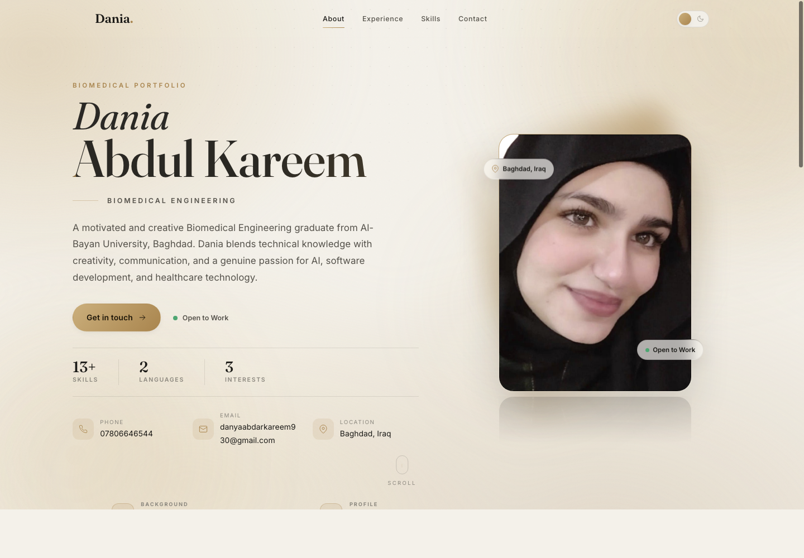
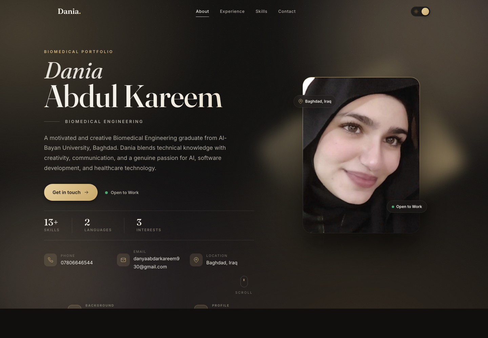
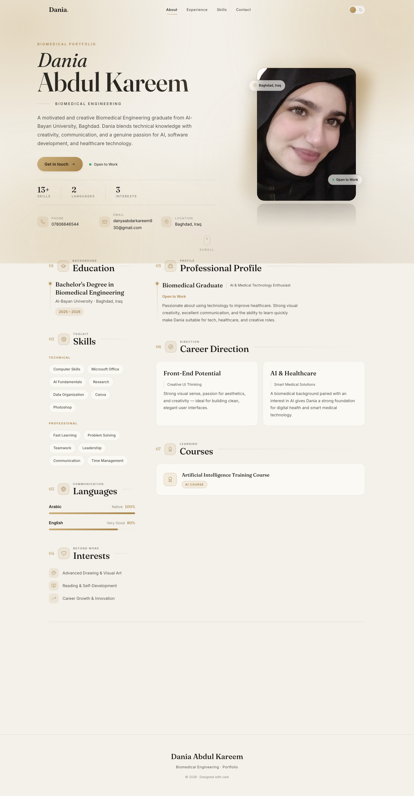
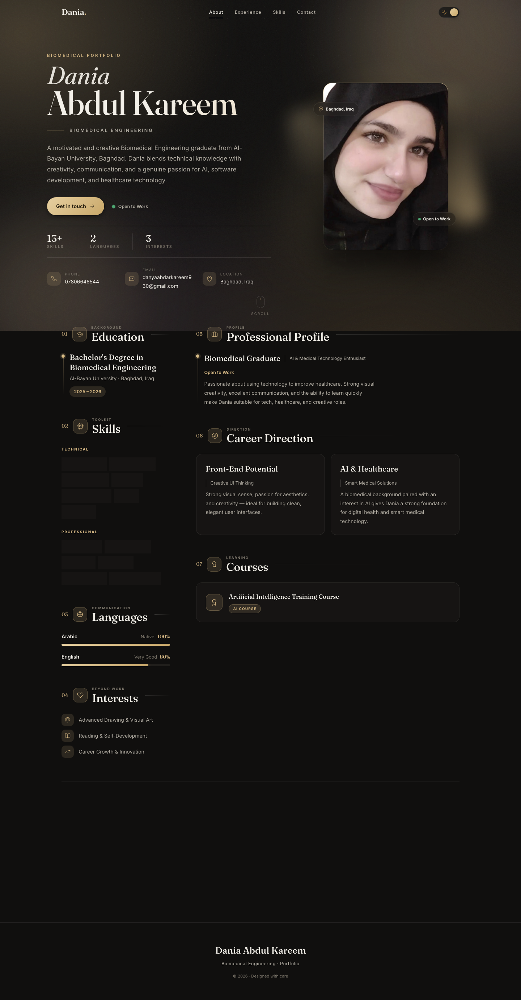

<div align="center">

# Dania Abdul Kareem — Portfolio

A premium, award-worthy personal portfolio for a **Biomedical Engineering** graduate — built as a cinematic, luxury web experience rather than a plain CV.

Champagne &amp; graphite palette · glassmorphism · animated aurora background · full dark/light theme system.

</div>

---

## Overview

`dania-portfolio` is a single-page personal portfolio designed to feel like a high-end product landing page (in the spirit of Apple, Stripe, Linear, and Framer). It presents Dania Abdul Kareem's profile, education, skills, languages, interests, career direction, courses, and contact details through an elegant, motion-rich interface.

The project is intentionally lightweight: **no UI or animation libraries** — every icon, animation, and interaction is hand-built with React and modern CSS to keep the bundle tiny and the experience buttery smooth (60 fps).

## Features

- 🎬 **Cinematic hero** — Fraunces display type, a 3D cursor-tilt profile photo with glow, reflection and floating glass chips, plus animated count-up stats.
- 🌌 **Animated background** — layered aurora mesh, floating blurred orbs, a subtle dot grid, and film grain (all GPU-friendly).
- 🌗 **Complete theme system** — detects OS preference &amp; time of day, follows OS changes live, persists your choice, and switches with a View-Transitions circular reveal. Dark mode is a distinct design, not an inversion.
- ✨ **Premium micro-interactions** — magnetic buttons, cursor-follow card spotlights, animated nav underline with active-section highlighting, animated progress bars, and scroll-reveal with stagger.
- 🧩 **Consistent icon system** — a single custom SVG icon set (24px grid, 1.5 stroke, `currentColor`) so every icon matches.
- 🧱 **Clean architecture** — content is data-driven, UI is split into small reusable components, behavior lives in focused hooks, and styling is a tokenized design system.
- ♿ **Accessible** — semantic HTML, ARIA labels, visible focus states, keyboard support, and full `prefers-reduced-motion` handling.
- 📱 **Responsive, mobile-first** — a native-app-quality experience down to small screens, including a glass slide-down menu.
- ⚡ **Performance-minded** — tiny CSS/JS bundles, lazy image decoding, IntersectionObserver-based reveals, and no heavy dependencies.

## Tech Stack

| Area          | Choice                                             |
| ------------- | -------------------------------------------------- |
| Framework     | [React 19](https://react.dev)                      |
| Build tool    | [Vite](https://vite.dev)                           |
| Styling       | Modern CSS (custom properties, layered design tokens) |
| Icons         | Custom inline SVG icon component                   |
| Animation     | CSS animations + IntersectionObserver + View Transitions API |
| Fonts         | Fraunces (display) + Inter (UI)                    |
| Linting       | ESLint (flat config)                               |

## Project Structure

```
src/
├─ components/     # UI components (Hero, Navbar, Section, Contact, Icon, …)
├─ hooks/          # useTheme, useReveal, useScrollProgress, useActiveSection, useInteractions
├─ data/           # cv.js (all content), photo.js (image fallback)
├─ styles/         # tokens.css, base.css, components.css
├─ App.jsx
└─ main.jsx
public/            # favicons, web manifest
```

## Getting Started

### Prerequisites

- [Node.js](https://nodejs.org) 18+ and npm

### Installation

```bash
git clone git@github.com:maysabah/dania-portfolio.git
cd dania-portfolio
npm install
```

### Run the development server

```bash
npm run dev
```

Then open the local URL printed in the terminal (default: `http://localhost:5173`).

> **Note:** open the app through the dev server — opening `index.html` directly from the file system will show a blank page, because the browser cannot resolve the module/JSX pipeline without Vite.

## Build

```bash
npm run build     # production build to dist/
npm run preview   # preview the production build locally
```

## Linting

```bash
npm run lint
```

## Responsive Design

The layout is fluid and mobile-first. A two-column desktop layout gracefully collapses to a single column, the navigation becomes a glass slide-down menu, and the hero re-stacks with the profile photo leading. Spacing, type scale, and touch targets are tuned per breakpoint for a first-class mobile experience.

## Dark / Light Mode

The theme system:

- **Auto-detects** the operating system color scheme and the time of day on first load.
- **Follows OS changes in real time** while the user hasn't chosen manually.
- **Remembers your choice** via `localStorage` once you use the toggle.
- **Animates the switch** with a circular View-Transitions reveal and smooth color cross-fades.
- Ships **distinct shadows, gradients, and glass effects** per theme — dark mode is designed, not inverted.

## Screenshots

| Light | Dark |
| ----- | ---- |
|  |  |
|  |  |

## Live Demo

🔗 _Coming soon_ — deploy to Vercel, Netlify, or GitHub Pages and add the link here.

## License

Released under the [MIT License](LICENSE).

---

<div align="center">
Designed &amp; built with care.
</div>
